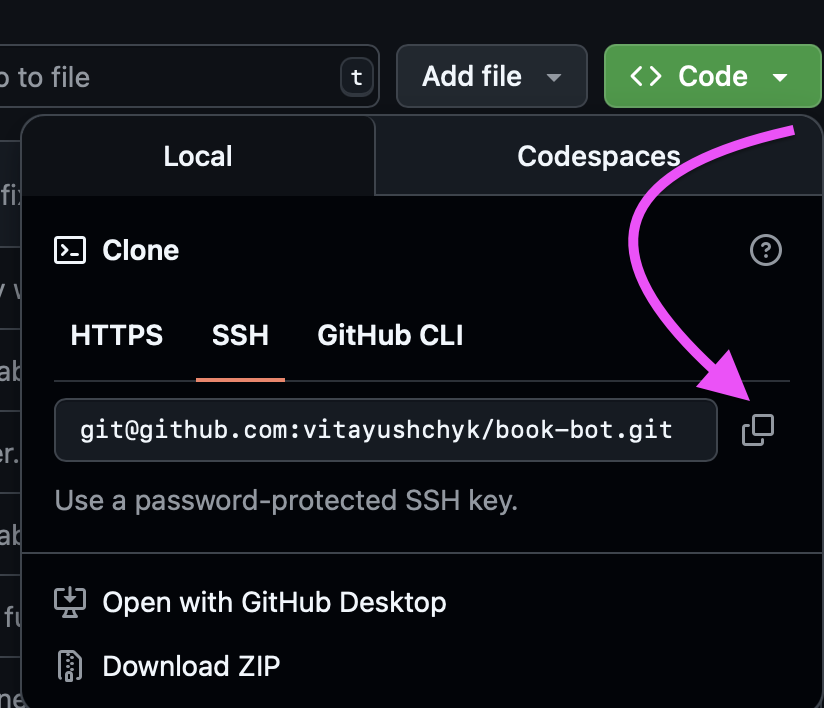

# 📚 HippoBookSter Bot

---
## 🤖 What is this?

[HippoBookSter bot](https://t.me/HippoBookSterBot) is a Telegram bot that helps you find books at great prices, shows ratings and short descriptions from the **Google Books API** and bookshops.  
> Just search for a book by title – and get a quick overview, the best prices, ratings, and direct links for purchase!

---
## 🚀 Features

- Search for books by title or author using the `/findbook` command
- Get prices from different online bookstores (integrated via parsers)
- View ratings and short descriptions for each book
- Donate and support development
- Telegram webhooks
- FastAPI backend
- Dockerized
- AWS deployment
- CI/CD automation

---
## 🛠️ Tech Stack

---

## ⚡️ Getting Started

### 1. Clone the repository

Or use [GitHub Desktop](https://desktop.github.com/):

---
### 2. Prepare environment variables

- Create a `.env` file in the root directory and set the environment variables according to `.env.example`.

---

### 3. Run the app with Docker

1. Make sure [Docker](https://docs.docker.com/get-docker/) is installed.
- Run application:

      make run_app
- Open log:

      make open_log

## Apply migrations with Alembic

- Create migration. Usage `make create_migrations m="migration message"`:

      make create_migrations

- Apply migrations:

      make migrate

---

## Interactive API Docs

[http://host:port/docs](http://host:port/docs) — automatic documentation (Swagger UI) will be available after you start the server.

---

## Deployment

The project is deployed on AWS using:
- [ECS](https://aws.amazon.com/ecs/)
- [EC2](https://aws.amazon.com/ec2/)
- [ECR](https://aws.amazon.com/ecr/)
- [ElastiCache](https://aws.amazon.com/elasticache/)
- [Route53](https://aws.amazon.com/route53/)

CI/CD automation is set up via GitHub Actions — see `deploy.yml`.

---

## Try it now!

▶️ [@HippoBookSterBot on Telegram](https://t.me/HippoBookSterBot)

---

## Contributors

- [Vita Yushchyk](https://www.linkedin.com/in/vita-yushchyk-484680205/)

---

## ❤️ Support the Bot

- Use the `/donate` command inside the bot to make a donation
- Leave feedback, suggest a feature, or share with a friend!

> *HippoBookSter Bot — your intelligent book-finding assistant for Telegram!*